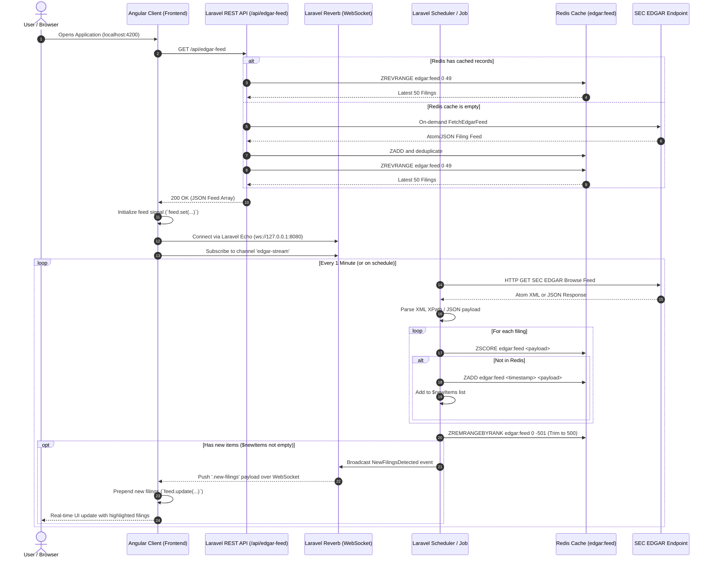
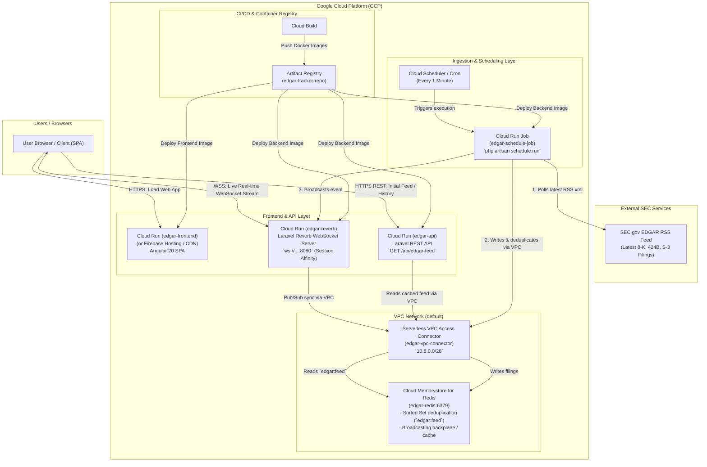

# SEC EDGAR Real-Time Filing & Issuance Tracker

An end-to-end real-time tracking application that ingests corporate filings from the U.S. Securities and Exchange Commission (SEC) EDGAR system, processes and deduplicates records in Redis, broadcasts live filing alerts via WebSockets (Laravel Reverb), and renders an auto-updating live feed using Angular.

---

## Architecture Overview

```
+-----------------------------------------------------------------------------------+
|                               SEC EDGAR API                                       |
|               (Atom / RSS XML & JSON Filing Feeds)                                |
+-----------------------------------------+-----------------------------------------+
                                          |
                                          | HTTP GET (User-Agent Compliant)
                                          v
+-----------------------------------------------------------------------------------+
|                               LARAVEL BACKEND                                     |
|                                                                                   |
|   +---------------------------------------------------------------------------+   |
|   |  Scheduled Job / Ingestion (FetchEdgarFeed)                               |   |
|   |  - Polls SEC EDGAR feed every minute                                      |   |
|   |  - Parses Atom XML / JSON payloads                                        |   |
|   |  - Normalizes accession numbers, company info, forms, and links           |   |
|   +---------------------+-----------------------------------------------------+   |
|                         |                                                         |
|         Deduplicate &   |                          Dispatches Event               |
|         ZADD / ZREVRANGE|                          (NewFilingsDetected)           |
|                         v                                                         v
|   +---------------------------+             +---------------------------------+   |
|   |       REDIS SERVER        |             |      LARAVEL REVERB SERVER      |   |
|   |  - Sorted Set `edgar:feed`|             |      (WebSocket on port 8080)   |   |
|   |  - Score: Unix Timestamp  |             |      Channel: `edgar-stream`    |   |
|   |  - Capped at 500 entries  |             |      Event: `.new-filings`      |   |
|   +-------------+-------------+             +----------------+----------------+   |
|                 |                                            |                    |
|                 | REST API (`GET /api/edgar-feed`)           | WebSocket Push     |
+-----------------+--------------------------------------------+--------------------+
                  |                                            |
                  | Initial Load (HTTP)                        | Live Stream (WS)
                  v                                            v
+-----------------------------------------------------------------------------------+
|                               ANGULAR FRONTEND                                    |
|                                                                                   |
|   +---------------------------------------------------------------------------+   |
|   |  FeedService                                                              |   |
|   |  - Fetches top 50 initial filings from Laravel REST API                   |   |
|   |  - Subscribes to Reverb WebSocket channel `edgar-stream` via Laravel Echo |   |
|   |  - Emits new items through RxJS Subject                                   |   |
|   +-------------------------------------+-------------------------------------+   |
|                                         |                                         |
|                                         v                                         |
|   +---------------------------------------------------------------------------+   |
|   |  App Component                                                            |   |
|   |  - Reactive State with Angular Signals (`signal<any[]>`)                  |   |
|   |  - Live prepends new incoming filings to the top of the feed              |   |
|   |  - Direct links to SEC EDGAR primary documents and filing timestamps      |   |
|   +---------------------------------------------------------------------------+   |
+-----------------------------------------------------------------------------------+
```

---

## Data Flow Diagram



---

## Detailed Component Workflow

### 1. Ingestion Engine (`backend/app/Jobs/FetchEdgarFeed.php`)
* **SEC Compliance**: Sends requests to SEC EDGAR Atom/JSON feeds with a declared, compliant `User-Agent` header (`Detroit-Issuance-Tracker <email>`) as required by SEC fair access policies.
* **Dual Format Parsing**:
  * **JSON Filings**: Handles structured company submissions and recent filing arrays (CIK, form types, report dates, accession numbers, and primary document paths).
  * **Atom/RSS XML**: Extracts entries via XPath queries across namespaces (`entry`, `title`, `updated`/`pubDate`, `link`, `guid`/`id`).
* **Deduplication & Storage**:
  * Checks uniqueness using `Redis::zscore('edgar:feed', $payload)`.
  * Inserts new filings into the Redis Sorted Set `edgar:feed` indexed by unix timestamp score.
  * Prunes older filings with `Redis::zremrangebyrank('edgar:feed', 0, -501)` to maintain a fixed 500-item memory window.
* **Broadcasting**:
  * When new filings are detected, dispatches `NewFilingsDetected` event carrying the new records.

### 2. Real-Time Broadcasting (`backend/app/Events/NewFilingsDetected.php`)
* Implements `ShouldBroadcast`.
* Publishes on the public channel `edgar-stream`.
* Broadcasts as `.new-filings` (broadcast name `new-filings`).
* Powered by **Laravel Reverb**, a high-performance WebSocket server native to Laravel.

### 3. REST API (`backend/routes/api.php`)
* **Endpoint**: `GET /api/edgar-feed`
* Fetches the top 50 records from the Redis Sorted Set (`Redis::zrevrange('edgar:feed', 0, 49)`).
* Includes a self-healing fallback: if the cache is cold/empty, it invokes `FetchEdgarFeed` on-demand before returning results.

### 4. Reactive Frontend (`frontend/src/app/`)
* **`FeedService` (`feed.ts`)**:
  * Instantiates `Echo` with `reverb` broadcaster configuration.
  * Listens to channel `edgar-stream` and event `.new-filings`.
  * Exposes `getInitialFeed(): Observable<any[]>` for baseline data.
  * Exposes `getLiveUpdates(): Observable<any[]>` for real-time WebSocket events.
* **`App` Component (`app.ts`)**:
  * Uses Angular signals (`signal<any[]>([])`) for fine-grained reactivity.
  * Sets initial state on load and prepends incoming stream bursts using `feed.update(list => [...newFilings, ...list])`.
  * Renders filing titles with direct outbound links to official SEC EDGAR archival documents and formatted filing timestamps.

---

## Tech Stack

| Layer | Technologies |
|---|---|
| **Backend Framework** | Laravel 12/13, PHP 8.3+ |
| **Real-Time WebSockets** | Laravel Reverb, Laravel Broadcasting |
| **Caching & Ingestion** | Redis (Predis), Laravel Queues & Scheduler |
| **Parsing** | SimpleXML, XPath, JSON Decoder |
| **Frontend Framework** | Angular 22+ (Standalone Components, Signals) |
| **WebSocket Client** | Laravel Echo, Pusher-JS |
| **Testing** | PHPUnit (Backend), Vitest (Frontend) |

---

## Project Structure

```
capital-raise-dilute/
├── backend/
│   ├── app/
│   │   ├── Events/
│   │   │   └── NewFilingsDetected.php   # Broadcast event for new SEC filings
│   │   └── Jobs/
│   │       └── FetchEdgarFeed.php       # Ingestion, parsing, deduplication, & broadcasting
│   ├── config/
│   │   ├── broadcasting.php             # Broadcast connections (Reverb, Pusher)
│   │   └── reverb.php                   # Laravel Reverb WebSocket server config
│   ├── routes/
│   │   ├── api.php                      # /api/edgar-feed endpoint
│   │   └── console.php                  # Scheduler job definition (runs every minute)
│   ├── tests/
│   │   └── Feature/
│   │       └── EdgarFeedTest.php        # Ingestion & API feature tests
│   └── composer.json
├── frontend/
│   ├── src/
│   │   ├── app/
│   │   │   ├── services/
│   │   │   │   ├── feed.ts              # Echo WebSocket listener & HTTP API service
│   │   │   │   └── feed.spec.ts         # Service unit tests
│   │   │   ├── app.ts                   # Main Angular component with reactive signals
│   │   │   ├── app.spec.ts              # Component integration tests
│   │   │   └── app.config.ts            # Application providers & HTTP client setup
│   └── package.json
└── README.md
```

---

## Setup & Installation

### Prerequisites
* **PHP 8.3+** with `ext-curl`, `ext-redis` or `predis`, `ext-simplexml`
* **Composer**
* **Node.js (v20+)** & **npm**
* **Redis Server** (running locally on port 6379)

---

### 1. Backend Setup

1. Navigate to the backend directory:
   ```bash
   cd backend
   ```
   Junie says:


   Option 1: Start Redis via WSL (Recommended & Already Installed)
In your PowerShell terminal, run:
   ```bash
wsl -d Ubuntu sudo service redis-server start

or (You can check if it is running by executing: wsl -d Ubuntu redis-cli ping which should return PONG)
Alternatively, to run it directly in the foreground in a dedicated terminal window:

wsl -d Ubuntu redis-server
   ```

2. Install PHP dependencies:
   ```bash
   composer install
   ```

3. Configure environment file:
   ```bash
   cp .env.example .env
   php artisan key:generate
   ```

4. Ensure your `.env` contains Redis and Reverb settings:
   ```env
   BROADCAST_CONNECTION=reverb

   REDIS_CLIENT=predis
   REDIS_HOST=127.0.0.1
   REDIS_PASSWORD=null
   REDIS_PORT=6379

   REVERB_APP_ID=capital_raise_app
   REVERB_APP_KEY=capital_raise_reverb_key
   REVERB_APP_SECRET=capital_raise_secret
   REVERB_HOST="localhost"
   REVERB_PORT=8080
   REVERB_SCHEME=http
   ```

5. Run migrations:
   ```bash
   php artisan migrate
   ```

---

### 2. Frontend Setup

1. Navigate to the frontend directory:
   ```bash
   cd ../frontend
   ```

2. Install Node dependencies:
   ```bash
   npm install
   ```

---

## Required Servers & Services

To run the full end-to-end real-time tracking application, the following **5 services/servers** must be started:

| # | Service / Server | Command | Default Port / URL | Purpose |
|---|---|---|---|---|
| **1** | **Redis Cache Server** | `redis-server` | `127.0.0.1:6379` | In-memory storage & deduplication sorted set (`edgar:feed`) |
| **2** | **Laravel API Server** | `php artisan serve` | `http://127.0.0.1:8000` | REST API endpoint (`GET /api/edgar-feed`) |
| **3** | **Laravel Reverb Server** | `php artisan reverb:start` | `ws://127.0.0.1:8080` | WebSocket broadcast server for real-time live push (`edgar-stream`) |
| **4** | **Laravel Scheduler Worker** | `php artisan schedule:work` | N/A (Background CLI) | Polls SEC EDGAR feed every minute via `FetchEdgarFeed` job |
| **5** | **Angular Frontend Server** | `ng serve` or `npm start` | `http://localhost:4200` | User Interface rendering reactive feed with Angular Signals |

---

## Running the Application

Start each service in a separate terminal window (or run in background):

### Terminal 1: Redis Server
```bash
redis-server
```

### Terminal 2: Laravel HTTP Server (API)
```bash
cd backend
php artisan serve
# Available at http://localhost:8000
```

### Terminal 3: Laravel Reverb WebSocket Server
```bash
cd backend
php artisan reverb:start
# Listening on ws://127.0.0.1:8080
```

### Terminal 4: Laravel Task Scheduler (EDGAR Ingestion Worker)
```bash
cd backend
php artisan schedule:work
```
> **Manual Ingestion Check**: You can manually trigger a fetch immediately by requesting `http://localhost:8000/api/edgar-feed` or by running:
> ```bash
> php artisan tinker --execute="(new \App\Jobs\FetchEdgarFeed())->handle();"
> ```

### Terminal 5: Angular Frontend Client
```bash
cd frontend
ng serve
# Access the web app at http://localhost:4200
```

---

## Running Tests

### Backend Unit & Feature Tests
```bash
cd backend
php artisan test
```

### Frontend Unit & Component Tests
```bash
cd frontend
npm test
```

---

## Google Cloud Deployment

The repository includes deployment scripts and container definitions for deploying to Google Cloud (Cloud Run, Cloud Memorystore, Cloud Scheduler, and Firebase Hosting / Cloud CDN):

### Quick Deploy (Automated Script)

- **PowerShell (Windows)**:
  ```powershell
  .\deploy\deploy-gcp.ps1 -ProjectId YOUR_PROJECT_ID -Region us-central1
  ```
- **Bash (Linux/macOS/Cloud Shell)**:
  ```bash
  chmod +x ./deploy/deploy-gcp.sh
  ./deploy/deploy-gcp.sh
  ```

### Build with Google Cloud Build

Submit the build using the provided `cloudbuild.yaml`:
```bash
gcloud builds submit --config cloudbuild.yaml
```

### Hosting Frontend on Firebase
```bash
cd frontend
npm run build
firebase deploy --only hosting
```

---

## Google Cloud Architecture & Deployment Diagram

When deployed to Google Cloud Platform (GCP), the application operates as a fully managed, serverless, and auto-scaling real-time event pipeline:



### Architecture Topology Diagram (ASCII / Text)

```text
+----------------------------------------------------------------------------------------------------+
|                                    GOOGLE CLOUD PLATFORM (GCP)                                     |
|                                                                                                    |
|  +----------------------------------------------------------------------------------------------+  |
|  | [CI/CD] Cloud Build  ==>  Artifact Registry (Docker Container Images: Backend & Frontend)     |  |
|  +----------------------------------------------------------------------------------------------+  |
|                                                                                                    |
|  +-------------------------+      +-------------------------+      +----------------------------+  |
|  | Cloud Run: Frontend     |      | Cloud Run: REST API     |      | Cloud Run: Reverb WS       |  |
|  | (edgar-frontend)        |      | (edgar-api)             |      | (edgar-reverb)             |  |
|  | Port 8080 / HTTPS       |      | Port 8080 / HTTPS       |      | Port 8080 / WSS (Affinity) |  |
|  | (Angular 20 SPA)        |      | (Laravel REST API)      |      | (Laravel Reverb Server)    |  |
|  +------------^------------+      +------------^------------+      +-------------^--------------+  |
|               |                                |                                 |                 |
|               | (1. Load Webpage)              | (2. Initial Load / Cache)       | (3. Live Stream)|
|               |                                |                                 |                 |
|  +------------+--------------------------------+---------------------------------+--------------+  |
|  |                                  USER BROWSER / CLIENT                                       |  |
|  +----------------------------------------------------------------------------------------------+  |
|                                                                                                    |
|  +----------------------------------------------------------------------------------------------+  |
|  | SCHEDULED INGESTION PIPELINE:                                                                |  |
|  | Cloud Scheduler  ==[1 min trigger]==>  Cloud Run Job (edgar-schedule-job)                    |  |
|  |                                              |                                               |  |
|  |                                  (Pulls RSS) v                                               |  |
|  |                               +-------------------------+                                    |  |
|  |                               | SEC EDGAR System        |                                    |  |
|  |                               | (www.sec.gov RSS feed)  |                                    |  |
|  |                               +-------------------------+                                    |  |
|  +----------------------------------------------+-----------------------------------------------+  |
|                                                 | (Stores parsed filings & publishes events)       |
|                                                 v                                                  |
|  +----------------------------------------------------------------------------------------------+  |
|  | VPC NETWORK:                                                                                 |  |
|  |                                                                                              |  |
|  |                     +---------------------------------------------+                          |  |
|  |                     | Serverless VPC Access Connector             |                          |  |
|  |                     | (edgar-vpc-connector: 10.8.0.0/28)          |                          |  |
|  |                     +----------------------+----------------------+                          |  |
|  |                                            |                                                 |  |
|  |                                            v                                                 |  |
|  |                     +---------------------------------------------+                          |  |
|  |                     | Cloud Memorystore for Redis (edgar-redis)   |                          |  |
|  |                     | Port 6379 (Private IP)                      |                          |  |
|  |                     | - Feed storage & ZADD deduplication         |                          |  |
|  |                     | - Laravel Cache & Reverb Pub/Sub Backplane  |                          |  |
|  |                     +---------------------------------------------+                          |  |
|  +----------------------------------------------------------------------------------------------+  |
+----------------------------------------------------------------------------------------------------+
```

### Deployed Components & GCP Services

| Component | GCP Service | Role & Functionality in Cloud |
|---|---|---|
| **Frontend UI** | **Cloud Run (`edgar-frontend`)** / **Firebase Hosting** | Serves the Angular 20 SPA built with Signals, real-time audio alerts, and responsive dark theme across global CDNs. |
| **REST API** | **Cloud Run (`edgar-api`)** | Stateless container running PHP 8.2 / Laravel 12. Serves endpoints like `GET /api/edgar-feed` with high concurrency and automatic horizontal auto-scaling. |
| **WebSocket Server** | **Cloud Run (`edgar-reverb`)** | Runs Laravel Reverb with session affinity enabled, 3600s connection timeouts, and minimum 1 instance to keep WebSocket channels open for immediate live push notifications. |
| **Scheduled Ingestion** | **Cloud Scheduler** + **Cloud Run Job (`edgar-schedule-job`)** | Runs `php artisan schedule:run` every minute. Fetches the SEC EDGAR XML/RSS feed, parses Form 8-K/424B/S-3 filings, classifies capital raise / dilution signals, and triggers broadcasts. |
| **In-Memory Store** | **Cloud Memorystore (Redis)** | High-throughput, low-latency private in-memory database (`edgar:feed` sorted set) providing zero-duplicate ingestion and Redis Pub/Sub coordination. |
| **VPC Connectivity** | **Serverless VPC Access Connector** | Bridges serverless Cloud Run containers to the private VPC network where Redis Memorystore resides without exposing Redis to the public Internet. |
| **Container Registry** | **Artifact Registry** & **Cloud Build** | Automated container image building, vulnerability scanning, and storage for both backend and frontend container artifacts. |

### Data Flow in Production

1. **Ingestion & Filtering**:
   - Cloud Scheduler triggers `edgar-schedule-job` on Cloud Run every 60 seconds.
   - The job requests the SEC EDGAR RSS feed using compliant `User-Agent` headers.
   - Filings are parsed and classified for capital raise keywords (ATM offerings, direct placements, convertible notes, Form S-3 / 424B).
   - Filings are deduplicated and saved to Cloud Memorystore Redis (`edgar:feed` sorted set).

2. **Real-time Broadcasting**:
   - Newly discovered filings fire the `EdgarFeedUpdated` broadcast event.
   - The event is delivered through Laravel Reverb (`edgar-reverb`), pushing the JSON payload over open WebSockets (`edgar-stream` channel) to all connected clients.

3. **Client Consumption**:
   - The Angular client receives live WebSocket payloads and reactively updates state signals, trigger counters, badge pills, and audio chimes without page reload.
   - If a client disconnects or newly loads, it performs a fast HTTP GET request to `edgar-api`, which fetches the latest 50 filings directly from Cloud Memorystore Redis.
